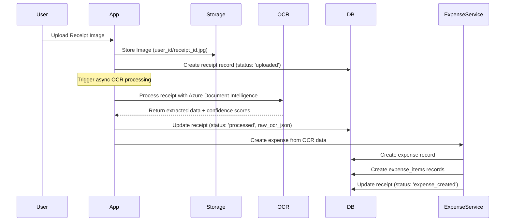

# Automatic Expense Creation from OCR Data

## 🎯 Overview

ExpenseIQ automatically extracts structured data from processed receipts and creates corresponding expense records and expense items in the database. This feature eliminates manual data entry and ensures accurate expense tracking from receipt scanning.

## 🔄 Process Flow

### 1. Receipt Upload & OCR Processing



### 2. Data Extraction & Processing

The system extracts the following data from Azure OCR responses:

**Receipt-Level Data:**
- Merchant name and contact info
- Transaction date and time
- Subtotal, tax, tip, and total amounts
- Receipt type

**Item-Level Data:**
- Item descriptions
- Quantities and unit prices
- Total prices per item
- Auto-generated categories

## 🏗️ Technical Implementation

### Core Components

#### 1. ExpenseService (`supabase/functions/_shared/expenseService.ts`)

```typescript
export class ExpenseService {
  async createFromOCR(receiptId: string, ocrData: any, userId: string): Promise<{
    success: boolean;
    expenseId?: string;
    itemsCreated?: number;
    error?: string;
  }>
}
```

**Key Features:**
- Validates OCR data quality and confidence scores
- Handles different date formats from OCR
- Auto-categorizes items based on description patterns
- Creates fallback items when individual items aren't detected
- Handles currency conversion and amount validation

#### 2. Enhanced Receipts API (`supabase/functions/receipts/index.ts`)

The receipts endpoint now automatically triggers expense creation after successful OCR:

```typescript
async function processReceiptOCR(receiptId: string, fileUrl: string, supabase: any, userId: string) {
  // 1. Process with Azure OCR
  const ocrResult = await azureOCR.processReceipt(fileUrl);
  
  // 2. Update receipt with OCR data
  await serviceSupabase.from('receipts').update({
    status: 'processed',
    raw_ocr_json: ocrResult.rawData,
    processed_at: new Date().toISOString()
  });
  
  // 3. Create expense from OCR data
  const expenseResult = await expenseService.createFromOCR(receiptId, ocrResult.rawData, userId);
  
  // 4. Update receipt status based on result
  await serviceSupabase.from('receipts').update({
    status: expenseResult.success ? 'expense_created' : 'expense_creation_failed'
  });
}
```

#### 3. Expense Processing API (`supabase/functions/expense-processing/index.ts`)

Additional endpoints for manual and bulk processing:

- `POST /expense-processing/create-from-receipt` - Create expense from existing receipt
- `POST /expense-processing/bulk-create` - Bulk create expenses from multiple receipts
- `GET /expense-processing/ready-receipts` - Get receipts ready for expense creation
- `GET /expense-processing/stats` - Get expense statistics

### Data Mapping

#### Receipt → Expense Mapping

```typescript
const expenseData = {
  receipt_id: receiptId,
  merchant_name: ocrData.merchantName || 'Unknown Merchant',
  transaction_date: parseTransactionDate(ocrData.transactionDate),
  currency: 'CAD', // Default for Canadian users
  subtotal: ocrData.subtotal || 0,
  tax: ocrData.tax || 0,
  total: ocrData.total || ocrData.subtotal || 0,
  payment_method: null, // Not typically extracted by OCR
  created_at: new Date().toISOString()
};
```

#### OCR Items → Expense Items Mapping

```typescript
const expenseItems = ocrData.items.map((item, index) => ({
  expense_id: expense.id,
  item_name: item.description || `Item ${index + 1}`,
  quantity: item.quantity || 1,
  unit_price: item.price || item.totalPrice || 0,
  total_price: item.totalPrice || item.price || 0,
  category: categorizeItem(item.description), // Auto-categorization
  created_at: new Date().toISOString()
}));
```

### Auto-Categorization Logic

The system automatically categorizes items based on description patterns:

```typescript
function categorizeItem(description: string): string {
  const desc = description.toLowerCase();
  
  // Food & Dining
  if (desc.match(/\b(coffee|tea|drink|food|meal|breakfast|lunch|dinner|pizza|burger|sandwich|salad|restaurant|cafe|bar)\b/)) {
    return 'Food & Dining';
  }
  
  // Transportation
  if (desc.match(/\b(gas|fuel|parking|taxi|uber|lyft|train|bus|metro|transport|toll)\b/)) {
    return 'Transportation';
  }
  
  // Office Supplies
  if (desc.match(/\b(pen|paper|notebook|stapler|envelope|folder|marker|office|supplies|printing)\b/)) {
    return 'Office Supplies';
  }
  
  // ... additional categories
  
  return 'General'; // Default category
}
```

## 📊 Receipt Status Flow

The receipt processing includes these status states:

1. **`uploaded`** - Initial state after image upload
2. **`processing`** - OCR is currently being processed
3. **`processed`** - OCR completed successfully, OCR data available
4. **`expense_created`** - Expense and items successfully created from OCR
5. **`expense_creation_failed`** - OCR succeeded but expense creation failed
6. **`ocr_failed`** - OCR processing failed
7. **`processing_failed`** - General processing error

## 🔧 Configuration & Validation

### Data Validation Rules

```typescript
function validateExpenseData(data: any): { isValid: boolean; errors: string[] } {
  const errors: string[] = [];
  
  // Required total amount
  if (!data.total && !data.subtotal) {
    errors.push('No total amount found in OCR data');
  }
  
  // Reasonable amount limits
  const amount = data.total || data.subtotal || 0;
  if (amount < 0) {
    errors.push('Total amount cannot be negative');
  }
  if (amount > 10000) {
    errors.push('Total amount seems unreasonably large (>$10,000)');
  }
  
  // Item validation
  if (data.items && Array.isArray(data.items)) {
    data.items.forEach((item: any, index: number) => {
      if (item.totalPrice && item.totalPrice < 0) {
        errors.push(`Item ${index + 1} has negative total price`);
      }
      if (item.quantity && item.quantity <= 0) {
        errors.push(`Item ${index + 1} has invalid quantity`);
      }
    });
  }
  
  return { isValid: errors.length === 0, errors };
}
```

### Date Parsing

The system handles various date formats from OCR:

```typescript
function parseTransactionDate(dateString?: string): string {
  if (!dateString) return new Date().toISOString().split('T')[0];

  // Handle formats: YYYY-MM-DD, MM/DD/YYYY, DD/MM/YYYY
  const formats = [
    /^(\d{4})-(\d{1,2})-(\d{1,2})$/,  // ISO format
    /^(\d{1,2})[\/\-](\d{1,2})[\/\-](\d{4})$/ // US/European format
  ];

  for (const format of formats) {
    const match = dateString.match(format);
    if (match) {
      // Parse and validate date
      // Return ISO date string or fallback to today
    }
  }
  
  return new Date().toISOString().split('T')[0]; // Fallback
}
```

## 🚀 Usage Examples

### Frontend Integration

```typescript
import { ReceiptService } from '@/services/receiptService';

// Upload receipt (automatic processing will create expense)
const uploadResult = await ReceiptService.uploadReceipt(imageUri, userId);

if (uploadResult.success) {
  console.log('Receipt uploaded, OCR and expense creation in progress...');
}

// Get receipts ready for manual expense creation
const readyReceipts = await ReceiptService.getReceiptsReadyForExpenses(userId);

// Manually create expense from receipt
const result = await ReceiptService.createExpenseFromReceipt(receiptId);

// Bulk create expenses
const bulkResult = await ReceiptService.bulkCreateExpenses([receiptId1, receiptId2]);

// Get expense statistics
const stats = await ReceiptService.getExpenseStats('2024-01-01', '2024-12-31');
```

### Monitoring & Stats

```typescript
// Get expense creation statistics
const stats = await expenseService.getExpenseStats(userId, startDate, endDate);

// Returns:
{
  totalExpenses: 45,
  totalAmount: 1250.75,
  avgAmount: 27.79,
  byMerchant: {
    "Starbucks": { count: 8, totalAmount: 67.20 },
    "Shell Gas": { count: 4, totalAmount: 180.00 }
  },
  byCategory: {
    "Food & Dining": { count: 12, totalAmount: 245.50 },
    "Transportation": { count: 6, totalAmount: 220.00 }
  }
}
```

## 🔧 Error Handling

### Common Issues & Solutions

1. **OCR Confidence Too Low**
   - Status: `processed_with_warnings`
   - Solution: Manual review or re-processing

2. **Expense Creation Failed**
   - Status: `expense_creation_failed`
   - Solution: Check validation rules, manually create expense

3. **Missing Total Amount**
   - Creates fallback item with merchant name
   - User can edit amounts manually

4. **Date Parsing Issues**
   - Falls back to current date
   - User can correct transaction date

### Debug Logging

All processing steps include comprehensive logging:

```typescript
console.log(`🚀 Starting OCR processing for receipt ${receiptId}`);
console.log(`✅ OCR completed for receipt ${receiptId}`);
console.log(`📋 Extracted Data Summary:`);
console.log(`   Merchant: ${ocrData.merchantName || 'N/A'}`);
console.log(`   Total: $${ocrData.total || 'N/A'}`);
console.log(`   Items: ${ocrData.items?.length || 0} items found`);
console.log(`🎉 Successfully created expense ${expenseId} with ${itemsCreated} items`);
```

## 🔄 Manual Processing Options

### Bulk Processing

```bash
# Use the expense-processing API for bulk operations
POST /functions/v1/expense-processing/bulk-create
{
  "receiptIds": ["receipt-1", "receipt-2", "receipt-3"]
}
```

### Single Receipt Processing

```bash
# Create expense from specific receipt
POST /functions/v1/expense-processing/create-from-receipt
{
  "receiptId": "receipt-123"
}
```

### Ready Receipts Query

```bash
# Get receipts ready for expense creation
GET /functions/v1/expense-processing/ready-receipts
```

This automatic expense creation system significantly reduces manual data entry while maintaining accuracy and providing flexibility for edge cases that require manual intervention.
